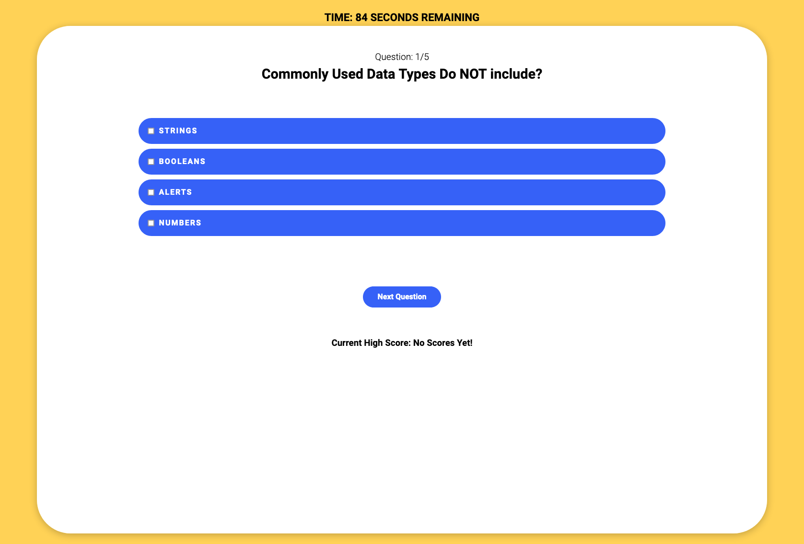

<!-- https://github.com/othneildrew/Best-README-Template -->

<!-- PROJECT LOGO -->
 

  

<h3 align="center">JavaScript Quiz App</h3>

  

    A JavaScript Quiz app, testing your knowledge in JS! Timed, with the ability to save high score's!
     
     
     
    <a href="https://garrettlockhart.github.io/javascript-quiz-app/">View Demo</a>
    ·
    <a href="https://github.com/GarrettLockhart/javascript-quiz-app/issues">Report Bug</a>
    ·
    <a href="https://github.com/GarrettLockhart/javascript-quiz-app/issues">Request Feature</a>
  

 
 
 

<!-- TABLE OF CONTENTS -->

  
Table of Contents

  <ol>
    <li>
      <a href="#about-the-project">About The Project</a>
        <li><a href="#built-with">Built With</a></li>
    </li>
    <li><a href="#live-site">Live Site</a></li>
  </ol>

 

<!-- ABOUT THE PROJECT -->

## About The Project

I built this only using JavaScript, HTML & CSS from scratch, it will keep track of your score and store that so even in the event of a page refresh or you close and open, you score will remain. If you get the wrong answers the time will deduct 20 second for every wrong answer. It utilizes arrays to store the question, possible answers and correct answers. I learned a lot with project including DOM manipulation, looping through arrays only when an event had ocurred, long story short, it was rad!

### Built With

- [HTML5](https://developer.mozilla.org/en-US/docs/Web/HTML)
- [CSS3](https://developer.mozilla.org/en-US/docs/Web/CSS)
- [JavaScript](https://developer.mozilla.org/en-US/docs/Web/JavaScript)

<!-- CONTRIBUTING -->

## Contributing

Any contributions you make are **greatly appreciated**.

If you have a suggestion that would make this better, please fork the repo and create a pull request. You can also simply open an issue with the tag "enhancement".
Don't forget to give the project a star! Thanks again!

1. Fork the Project
2. Create your Feature Branch (`git checkout -b feature/AmazingFeature`)
3. Commit your Changes (`git commit -m 'Add some AmazingFeature'`)
4. Push to the Branch (`git push origin feature/AmazingFeature`)
5. Open a Pull Request

<!-- CONTACT -->

## Live Site

Project Link: [https://garrettlockhart.github.io/javascript-quiz-app/](https://garrettlockhart.github.io/javascript-quiz-app/)
 
 

(<a href="#top">back to top</a>)

